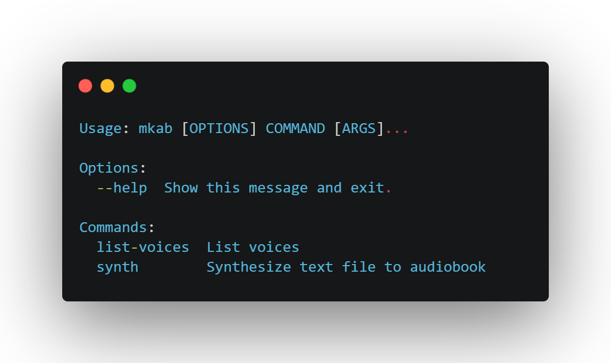

<h1 align="center">
  nginup
</h1>

<h3 align="center">A command-line for quickly generating nginx configuration</h3>



<p align="center">
  <a href="#key-features" style="color: red; padding-left: 10px; padding-right: 10px; padding-top: 5px; padding-bottom: 5px; border-radius: 3px; background-color: white; box-shadow: 0px 0px 5px 0px rgba(0,0,0,0.75);">Key Features</a> •
  <a href="#install">Install</a> •
  <a href="#develop">Develop</a> •
  <a href="#examples">Examples</a> •
  <a href="#contributing">Contributing</a> •
  <a href="#Todo">Todo</a> •
  <a href="#license">License</a>
</p>


## Key Features
* **Simple command line interface**
* **Lighting-fast nginx site configuration**
* **Extensible template based config using the beloved `Jinja2`**


## Requirements

* Python 3
* pip
* certbot
* certbot-nginx

## Install

*Install from source*

The following commands install an `ng` and `nginup` script to your `$PATH`

```
git clone https://github.com/grplyler/nginup.git
cd nginup
python setup.py install
```

## Develop

The following commands install an `ng` and `nginup` script to your `$PATH`
but they link back to the source so changes made in development will be reflected
in the command install in your $PATH.

```
git clone https://github.com/grplyler/nginup.git
cd nginup
python setup.py develop
```

## Examples


**Create a static site**
```
$ ng static /var/www/blog.mysite.com -d blog.mysite.com
```

`-d` specifived a sub-domain based virtualhost for routing.

**Create a static site with SSL (COMING SOON)**

```
$ ng static /var/www/blog.mysite.com --ssl
```

`--ssl` will instruct nginup to install a Let's Encrypt TLS Certificate

## Rationale

I created this tools to save time spinning up new `static`, `reverse proxy` and `php` virtualhosts in nginx.

## Disclaimer

The code and executables in this project are a **work in progress**. While they can be used an tools/toys and what have you, they are not production ready and **shouldn't be used on crital systems** without understanding these disclaimers. 


## Contributing

If you like this project, here are some ways you can contribute!

* Feature Requests
* Bug Reports
* Platform Testing

## Todo

* [] Add SSL Autoconfig with Let's Encrypt Cerbot
* [] Add PHP Config Generation Template

## License

MIT


